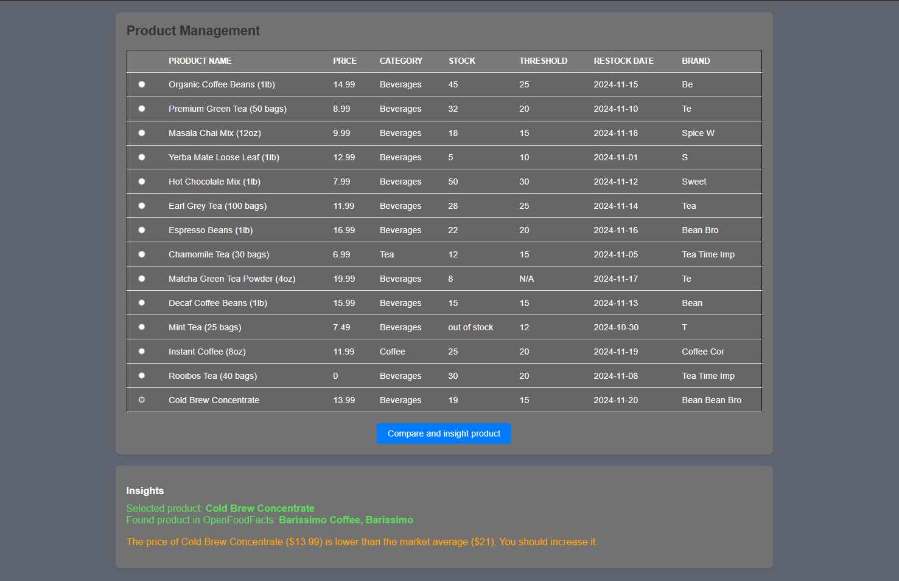

# 10EQSEvaluation Challenge

## how to run locally?

* make sure you have node and git installed
* clone the repository: git clone https://github.com/AguHDS/10EQSEvaluation

The project is divided into two parts: frontend and backend

* open the terminal in the frontend folder and run the command: npm install
* open the terminal in the backend folder and run the command: npm install
* make sure to config your .env variables, the only one required is the port
for example:
PORT_BACKEND=yourPort

To run the project, open a terminal in the backend folder and use: npm start

The project will be running on localhost:yourPort

Showcase of the interface

## Required API credentials
This API doesn't require API key or other stuff, it's easy to implement and that's why i choosed it. It's already configurated in backend

## Explanation of my aproach
- I have separated the frontend and backend, so the backend is responsible for the data and the frontend for the UI
- The main structure of the backend are: routes > middlewares > controllers
- I used the OpenFoodFacts API to search for products, and then compared the prices of the selected product with the average price of the market
- I converted the csv file to json using csvtojson and then used it to create the table in the frontend and make the comparisons

## Known issues or limitations
- most of the products are not available in OpenFoodFacts, so the search will return an exception made for this case.
The only one that are found on the API are the two last ones

## time spent on each component
backend: 6 hours
frontend: 8 hours

It could've taken more, but i copied things from another project i'm currently working on (github.com/AguHDS/Backups)